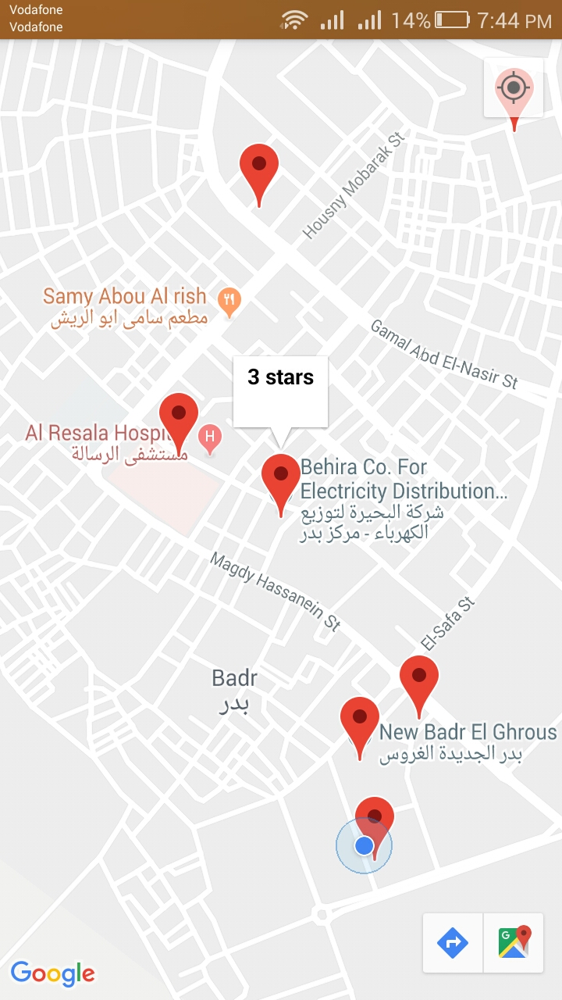
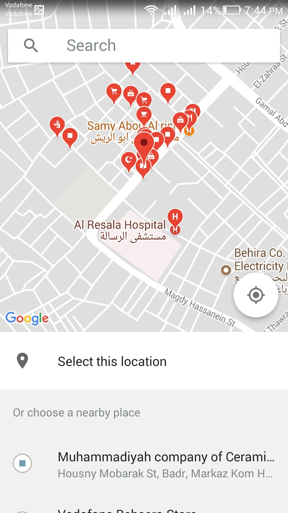
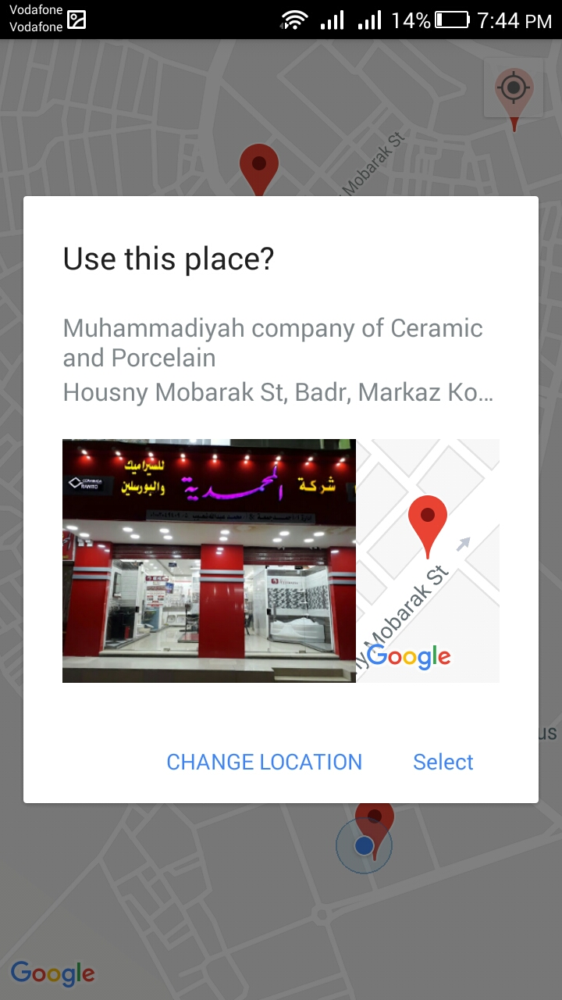
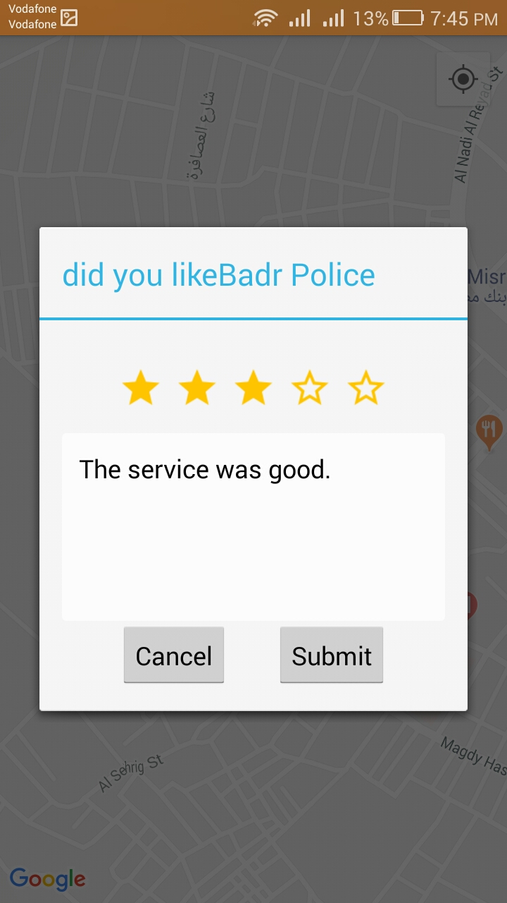
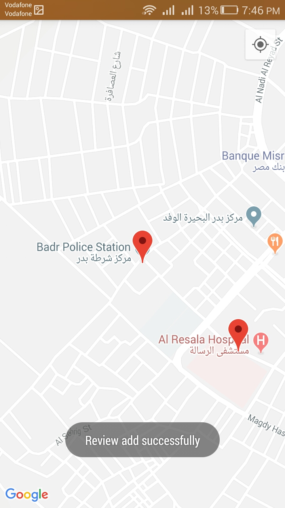

# Add Review To Place On Map

## Description

When user opens the app, it will check network state first
If network is connected to Internet it will check if GPS is enabled or not 
Else it will inform user to check `Internet Conection`  

If `GPS` is Enabled it will track user gps and display user location on the map  
Else it will request user to enable `GPS`  

If user added reviews before, it will be displayed as Markers on the Map.  

If user clicks on a place on the map it will navigate to `Pick Place Builder` 
to choose place sepcifiaclly with it's details, 
then it will back to Parent ActivityForResult method to handle returned place.  

When the selected place is returend the app will show a `Review & Rating Dialog` 
to help user to add review and rate the picked place.

When user submit the review it's added to Firebase Database and A marker added to displayed Map  

## Libraries and Tools
- Firebase (Database)
- Google Map SDK API
- Fragment Activity
- Interface and Callbacks
- GPS

## Screenshots

   
 
